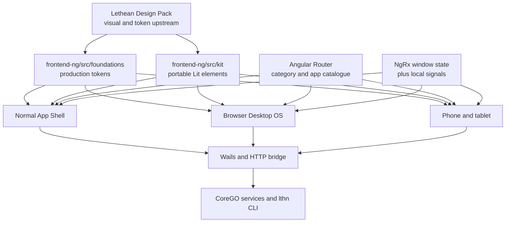

<!-- SPDX-License-Identifier: EUPL-1.2 -->

# Lethean Desktop Frontend Convergence Design

## Status

Approved direction on 2026-07-25. Implementation planning follows review of
this document.

## Context

Lethean Desktop began with a working Lit application whose growing collection
of capabilities made the interface cluttered. The replacement UI is not a
throwaway mock. It is a working Angular application intended to become the
owner's own development environment:

- one application model presented as a normal App Shell;
- a browser-hosted Desktop OS with windows, menu bar, Start/app menus, dock,
  taskbar, widgets, and session surfaces;
- phone and tablet presentations using the same window and route state;
- many small Lethean systems composed behind those presentations;
- capabilities at mixed maturity: working, partial, dormant after migration,
  or intentionally design-only.

The Angular upgrade prioritised getting these systems into the new shell.
Organisation and systematic reachability checks were secondary. Retirement
must therefore remove duplicate implementations without mistaking a partial or
temporarily disconnected capability for dead mock code.

## Goals

1. Make `frontend-ng/` the sole product frontend.
2. Preserve the design pack's portable Lit elements and token engine.
3. Keep Desktop, App Shell, phone, and tablet as presentations of one
   application and one route catalogue.
4. Inventory and restore useful capability before reorganising it.
5. Retire old application copies through Git history, not in-tree archives.
6. Make live, partial, dormant, and design-only states truthful and testable.
7. Repair migration drift in build scripts, bindings, documentation, fonts,
   and source-path references.
8. Keep the non-GUI `lthn` CLI and CoreGO services independent from frontend
   health.

## Non-goals

- Rewriting the UI again.
- Removing Lit from the Angular application.
- Replacing Angular Router with another menu or view registry.
- Introducing Angular SSR, hydration, or a second product frontend.
- Deleting a surface merely because its backing service is unavailable today.
- Reorganising every frontend file before current behaviour is recorded.
- Extracting npm packages from the design system during the retirement pass.
- Making the whole historical CoreGO compliance backlog part of this work.

## Verified current state

### Product frontend

- Angular 22, standalone components, client-side rendering, hash routing.
- Routes are `#/`, `#/w/:app`, and `#/tray`.
- The category, app, and child-view menus derive from Angular route metadata.
- NgRx owns shared desktop/window state; signals own local component state.
- `ViewMode` supports `desktop`, `shell`, and `device`; device size supports
  `small`, `large`, and `full`.
- The mobile runtime selects phone or tablet presentation without creating a
  second application tree.
- The current frontend build succeeds and all 133 Angular tests pass.

### Design-pack relationship

The supplied Lethean Design Pack is the design and brand upstream. Its 23 base
desktop applications are present in the Angular product. The product adds 43
lazy routed surfaces.

The production copy deliberately evolves the pack:

- common colour, brand, mode, spacing, typography, and base tokens are carried
  into `frontend-ng/src/foundations/`;
- Sass composition replaces the pack's direct CSS imports;
- fonts are self-hosted for offline and CSP-safe operation;
- Android joins the Darwin, iOS, and iPad platform profiles;
- `frontend-ng/src/kit/` contains the active typed Lit elements;
- Angular adds lazy routing, NgRx, localisation, WebMCP, Wails transports, and
  CoreGO-backed services.

The design pack remains portable reference material. Its Angular 18 sample
workspace and preview state are not a second product implementation.

### Capability is not merely mocked

Of the 43 shared routed surface definitions, 35 declare a Wails bridge method,
an HTTP load endpoint, or an action endpoint. Terminal sessions, plugin views,
Chat, Control, and Files also contain specialised integrations outside that
shared configuration layer.

This proves that source-level intent is predominantly live or partial. It does
not prove that every contract is currently registered and reachable. Runtime
reachability must be measured before retirement or reorganisation.

### Historical recovery

Commit `67b012f` is the Angular migration. The ignored
`frontend-lit-ref/frontend/` snapshot matches all 361 blobs from
`67b012f^:frontend` byte-for-byte. The retired application can therefore be
recovered from Git without retaining the ignored copy.

`docs/design/lit/`, `docs/design/Lethean-5.zip`, and the duplicate handover are
unbuilt archives of the older design implementation. The current top-level
`frontend/` contains only two generated Wails support files and is not an
application.

## Selected architecture

The selected approach is controlled convergence: one Angular product frontend
with a retained portable design layer.



### Source-of-truth rules

- Angular Router is the navigation source of truth.
- The app/category registries supply metadata and lazy component loaders but
  must agree with the route tree through tests.
- NgRx is the single durable window-state source.
- `frontend-ng/src/foundations/` is the production token implementation.
- `frontend-ng/src/kit/` is the product's portable custom-element
  implementation.
- CoreGO and Wails are authoritative for live capability and data.
- Design fixtures are allowed, but must not impersonate live backend state.

## Presentation model

Desktop, App Shell, phone, and tablet are not separate frontends.

1. A route selects an application and optional child view.
2. The window manager owns its live window instance.
3. The selected presentation decides how that same instance is framed:
   floating window, app-shell tab, or device view.
4. The same lazy component renders the content.
5. Deep links and tear-off windows resolve through the same route catalogue.

This is a core product feature and must survive retirement unchanged.

## Capability maturity model

Every application or surface will be audited into one of these states:

| State | Meaning | Required evidence |
|---|---|---|
| Live | Backing service is registered and the useful path works | Contract test and runtime smoke |
| Partial | Real integration exists, but only part of the intended workflow works | Passing supported path plus explicit unavailable states |
| Dormant | Useful code exists but registration, generated bindings, or contract drift currently blocks it | Identified break and retained source |
| Design-only | Intentionally static specimen, fixture, or future interaction | Clearly labelled fixture and no false live claims |
| Retired | Superseded implementation with no unique required behaviour | Recovery commit and deletion evidence |

The first implementation artefact is a capability matrix derived from the
route/app registries and checked against Go service registration. Status must
be based on evidence, not filenames, visual completeness, or whether a screen
contains seed data.

UI failures should be honest:

- keep last-known or sample data only when it is visibly labelled;
- show unavailable or disconnected state when a live call fails;
- do not silently replace failed live data with convincing fixture values;
- disable actions that cannot complete and explain the missing capability;
- preserve retry, cancellation, and bounded polling behaviour.

## Design-system boundary

Retirement keeps:

- `frontend-ng/src/foundations/`;
- `frontend-ng/src/kit/`;
- the `lit` runtime dependency;
- `kind: "lit"` plugin descriptors;
- the hoplite assets and brand tokens used by the product;
- useful explicit preview/offline fixtures.

The design pack may later become versioned packages such as
`@lethean/tokens` and `@lethean/elements`. That extraction is deliberately
deferred until the working product is stable. For now, pack changes are
reviewed and ported into the production locations rather than copied wholesale.

## Font-loading defect

The production build currently contains 76 bundled WOFF/WOFF2 assets and
compiled `@font-face` declarations for Geist, Geist Mono, Instrument Serif, and
Font Awesome. The fault is therefore not a missing npm dependency or missing
build output.

Runtime diagnosis must check both browser development and the embedded Wails
origin:

1. Record the computed `font-family` for UI, mono, editorial, and icon samples.
2. Evaluate `document.fonts.check(...)` for the expected face and weight.
3. Inspect font requests for URL, status, MIME type, CSP, and origin errors.
4. Verify the embedded server serves `media/*` rather than the SPA fallback.
5. Distinguish a failed load from the intentional
   `[data-platform="darwin"]` switch from Geist to SF Pro.
6. Add a focused runtime smoke test before changing token or platform policy.

The fix follows the measured cause: asset routing/MIME/CSP/base-path if requests
fail, or an explicit design decision if the native platform override is the
observed difference.

## Retirement boundary

### Remove after final verification

1. `frontend-lit-ref/`, after repeating the 361-blob Git comparison.
2. `docs/design/lit/`, `docs/design/Lethean-5.zip`, and the duplicate handover.
3. The top-level `frontend/` generated remnants, only after iOS and Android
   task outputs point at `frontend-ng/bindings/` and regeneration is verified.
4. The obsolete `.gitignore` entry for `frontend-lit-ref/`.
5. Old `frontend/src/lit`, `frontend/bindings`, `external/*`, Bun, React
   reference, and submodule instructions once their live replacements are
   documented.

Git remains the archive. The attached design pack remains untouched outside
this repository.

### Do not remove

- a routed Angular surface without a capability audit;
- a Go service because its current screen is incomplete;
- a Lit element used by Angular or plugin views;
- route-derived navigation or shared window state;
- mobile support before mobile task verification;
- fixture data that has a truthful and useful offline or design role.

## Migration sequence

### 1. Baseline

- Generate the capability matrix.
- Record route, service, binding, and runtime evidence.
- Capture smoke checks for Desktop, App Shell, phone, and tablet.
- Diagnose fonts without changing design policy.

### 2. Repair migration plumbing

- Correct binding-generation destinations and stale `generates` declarations.
- Remove the nonexistent `external/gui` generator input.
- Replace the old Bun/frontend audit path with Angular/npm.
- Remove obsolete CI submodule assumptions.
- Repair stale source comments and documentation paths.

### 3. Restore or label capability

- Repair high-value dormant integrations in place.
- Add truthful partial/unavailable states.
- Keep route IDs and deep links stable.
- Do not combine this with broad folder moves.

### 4. Retire duplicate implementations

- Repeat Git recovery checks.
- Remove ignored and tracked code archives.
- Remove the misleading top-level `frontend/` only after mobile verification.
- Make deletions in reviewable commits with recovery references.

### 5. Organise incrementally

- Consolidate duplicated surface patterns only after behaviour tests exist.
- Keep registry, route, presentation, bridge, and design-system layers clear.
- Move one coherent capability family at a time.

### 6. Add regression guardrails

- Assert every registered app resolves to one lazy component.
- Assert every category and deep link resolves through Angular Router.
- Smoke all presentation modes against the same application state.
- Test live failure versus explicit fixture behaviour.
- Verify expected token names and font availability.
- Reject reintroduction of retired top-level frontend implementations.

## Verification

Frontend gates:

```bash
cd frontend-ng
npm run build
npm run test:ci
```

Focused Go gates:

```bash
go test ./go/pkg/<changed-package>
go test ./go/pkg/desktop
```

Repository checks proportional to each change:

```bash
gofmt -l go/
git diff --check
go vet ./go/...
wails3 task test
```

Mobile binding/build tasks are required before deleting top-level `frontend/`.
The existing v0.9.0 CoreGO audit is a before/after no-regression diagnostic,
not an all-green prerequisite for this convergence work.

## Recovery and commit policy

- Preserve route IDs and deep-link contracts during each step.
- Reference `67b012f^` when removing the retired Lit application snapshot.
- Reference the design archive's introducing commits when removing tracked
  prototypes.
- Keep plumbing repairs separate from archive deletion where practical.
- Do not mix unrelated compliance rewrites into retirement commits.
- If a capability regresses, restore the affected path rather than restoring
  an entire retired frontend.

## Expected outcome

The repository will contain one product UI: the Angular 22 application. That
application will continue to present itself as a normal app shell, browser
desktop, phone, or tablet while sharing one router and one state model. The Lit
design layer remains portable for other Lethean systems. Existing capability
is measured and preserved, partial work is represented honestly, duplicate
applications live only in Git history, and future development has a clear,
testable place to land.
